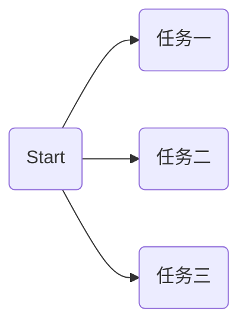
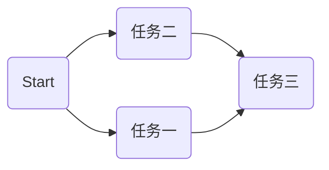
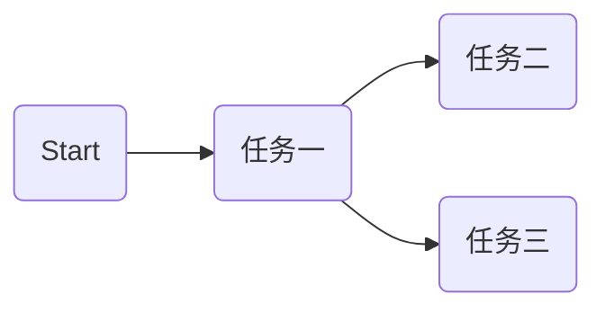
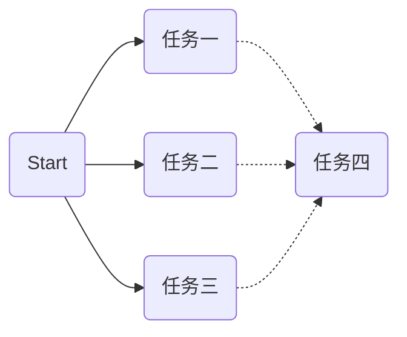
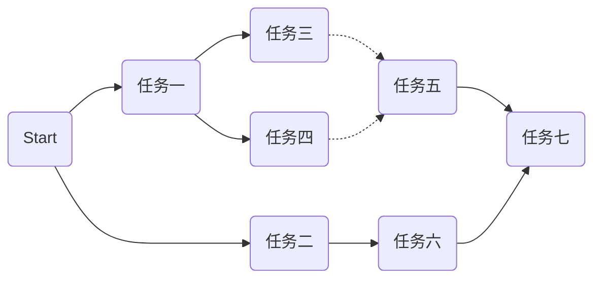

# ConcurrentScheduler

## 背景
产品微服务化后，服务之间多了很多远程调用，为了提升性能，不少同事采用多线程异步调用的方式，编排相关任务去完成业务。工作中发现此类需求比较普遍，开发同学除了开发业务逻辑以外，还耗费不少精力在任务编排的开发上，各自代码风格迥异，难以理解维护，开发效率低下，且容易引入bug。

为解决此痛点问题，基于JDK8的CompletableFuture组合式异步编程特性，封装了一套通用的单机任务编排框架，业务侧只需聚焦于业务逻辑，以统一的风格进行任务的编排，从而增强了代码的维护性，提升了开发效率。

## 通用场景

1. 多个任务串行，后一个依赖前一个任务的结果

2. 多个任务并行

3. 阻塞等待多个任务执行完毕，启动任务

4. 阻塞等待某个任务执行完毕后启动多个任务

5. 多个任务任意一个完成了，就启动后一个任务

6. 复杂场景

> 经统计，如上场景，基本覆盖了目前我们产品所遇到的场景，满足了相关的需求。

## 关键特性

1. 任务的任意编排
2. 任务间依赖关系的强依赖和弱依赖
3. 任务间结果的传递
4. 任务链的超时处理
5. 每个任务执行结果的回调
6. 高性能，低线程数

## 框架解析

## 快速开始

